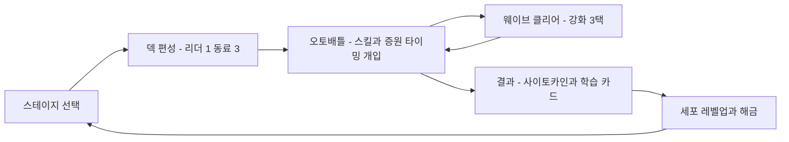

# 게임 디자인 문서

- 제품명: 면역 전쟁 (Immunity War)
- 문서 상태: draft
- 소유자: ih@toss.im
- 버전/수정일: v0.1 / 2026-08-23
- Source of truth: 게임 규칙, 상수, 유닛/적/스테이지 정의, 진행 구조, 온보딩, 저장 계약
- Depends on: 00-product-brief v0.1, 01-research-dossier v0.1
- Open blockers: 없음 (수치는 balance_sim으로 조정 예정이며 본 문서가 초기값 canonical)
- 승인 근거: 사용자 승인 전

## 경험 타임라인

| Step ID | 시간 | 시작 상태 | 입력 | 규칙 처리 | 보이는 결과 | 보상 | 다음 상태 | 실패/중단 |
| --- | ---: | --- | --- | --- | --- | --- | --- | --- |
| STEP-001 | 0~10s | 첫 실행, 저장 없음 | 전투 시작 탭 | 튜토리얼 스테이지 1-1 로드 | 박테리아 침투 인트로 모션 | 없음 | 전투 진입 | 앱 이탈 시 재실행에 동일 |
| STEP-002 | 10~60s | 전투 중, 웨이브1 | 리더 스킬 탭 1회 유도 | 스킬 실행, 쿨다운 시작 | 광역 이펙트 + 적 처치 | 처치 카운트 | 웨이브1 클리어 | 기지 HP 0 시 STEP-006 |
| STEP-003 | 60~90s | 웨이브 사이 | 강화 3택 중 1 탭 | 런 강화 적용 | 선택 카드 강조 + 즉시 스탯 반영 표시 | 강화 효과 | 웨이브2 시작 | 선택 전 대기 (일시정지 상태) |
| STEP-004 | 90~180s | 웨이브 2~3 | 증원 버튼(게이지 충전 시) | 임시 세포 투입 15s | 새 세포 등장 연출 | 전황 반전 | 스테이지 클리어 | 기지 HP 0 시 STEP-006 |
| STEP-005 | 180~240s | 결과 화면 | 보상 2배 광고 or 확인 | 사이토카인 지급, 저장 | 학습 카드 1장 공개 | 사이토카인, 학습 카드 | 스테이지 맵 복귀 | 광고 실패 시 기본 보상 지급 |
| STEP-006 | 패배 시 | 기지 HP 0 | 부활 광고 or 포기 | 부활: 기지 30% 복구 + 화면 내 적에 50% 피해 | 부활 연출 | 재도전 기회 | 전투 재개 or 결과(실패) | 광고 실패 시 실패 결과로 |

## 코어 루프



| Loop ID | 주기 | 입력 | 선택/숙련 | feedback | 보상 | friction | 변주 |
| --- | ---: | --- | --- | --- | --- | --- | --- |
| LOOP-001 전투 | 30~60s/웨이브 | 리더 스킬, 증원 타이밍 | 스킬 사용 시점, 증원 온존 | 이펙트·사운드·햅틱, 처치 수 | 강화 3택 진입 | 없음 | 적 조합·환경 모디파이어 |
| LOOP-002 스테이지 | 3~5분 | 덱 편성, 강화 선택 | 상성 맞는 덱·강화 시너지 | 클리어 연출, 학습 카드 | 사이토카인 | 막힌 스테이지 | 챕터별 신규 적 |
| LOOP-003 메타 | 일 단위 | 레벨업, 해금 세포 실험 | 재화 배분, 덱 다양화 | 도감·스테이지 맵 진행 | 새 세포, 다음 챕터 | 재화 부족 | 챕터 보스, 해금 주기 |

## 규칙과 상태 머신

### 전투 상태 머신 (BattleController)

| State | Entry | Allowed actions | Tick/transition | Exit | Persist | Recover |
| --- | --- | --- | --- | --- | --- | --- |
| SETUP | 스테이지 진입 | 없음 | 세포 배치 연출 0.8s 후 RUNNING | RUNNING | run 스냅숏 생성 | 재실행 시 해당 웨이브부터 |
| RUNNING | 웨이브 시작 | 리더 스킬, 증원, 일시정지, 포기 | 스폰 이벤트 소비, 승패 판정 | 웨이브 전멸 or 기지 HP 0 | 없음 (웨이브 경계만) | 웨이브 시작으로 복귀 |
| BETWEEN_WAVES | 웨이브 전멸 | 없음 | 1.0s 후 CHOOSING_UPGRADE (마지막 웨이브면 FINISHED) | CHOOSING_UPGRADE | run 스냅숏 갱신 | 스냅숏 복원 |
| CHOOSING_UPGRADE | 강화 3택 표시 | 강화 1개 선택 | 선택 시 다음 웨이브 RUNNING | RUNNING | 선택 결과 즉시 저장 | 3택 재표시 (같은 시드) |
| REVIVE_OFFER | 기지 HP 0, 부활 미사용 | 부활 광고, 포기 | 광고 성공 시 RUNNING, 포기·실패 시 FINISHED | RUNNING or FINISHED | revive_used 저장 | 포기 처리 |
| FINISHED | 승패 확정 | 결과 확인 | BattleSummary 방출 | 결과 화면 | run 삭제, meta 갱신 저장 | 없음 |

### 피해 계산 (CombatRules 단일 경로)

```text
final_damage = base_damage
             x mark_mult      (표식 중이면 1.45 + 강화 보정, 아니면 1.0)
             x type_mult      (공격 태그 x 방어 태그 상성표)
             x upgrade_mult   (런 강화 곱연산 누적)
             x level_mult     (1 + 0.12 x (세포 레벨 - 1))
반올림: 소수 유지, 표시 시 내림
```

### 상성표 (type_mult)

| 공격 태그 \ 방어 태그 | swarm | armored | fast | toxin | biofilm |
| --- | ---: | ---: | ---: | ---: | ---: |
| phagocytosis (포식) | 1.4 | 0.8 | 1.0 | 1.0 | 0.8 |
| inflammatory (염증) | 1.3 | 1.0 | 1.0 | 1.2 | 0.8 |
| antibody (항체) | 1.0 | 1.2 | 1.3 | 1.0 | 1.0 |
| lytic (용해) | 0.7 | 1.5 | 1.0 | 1.0 | 1.3 |
| support 계열 | 1.0 | 1.0 | 1.0 | 1.0 | 1.0 |

- biofilm 보스의 실드는 표식(mark) 상태에서만 피해를 받는다. 보체 스킬은 실드에 2배 피해.
- 표식(옵소닌화)과 상성은 곱연산으로 중첩된다.

### 세포 로스터 (CellDef canonical 초기값)

| id | 이름 | 태그 | HP | 공격력 | 사거리 | 공격주기 s | 이속 | 스킬 (쿨다운 s) | 해금 |
| --- | --- | --- | ---: | ---: | ---: | ---: | ---: | --- | --- |
| macrophage | 대식세포 | innate, frontline, phagocytosis | 150 | 13 | 88 | 0.78 | 92 | 포식 돌진: 145px 내 적 끌어당김 + 기절 1.15s + 피해 16 (7.5) | 시작 보유 |
| neutrophil | 호중구 | innate, frontline, inflammatory | 110 | 10 | 102 | 0.54 | 126 | 염증 폭발: 전방 118px 원형 피해 42 (6.0) | 시작 보유 |
| b_cell | B세포 | adaptive, ranged, antibody | 95 | 12 | 154 | 0.92 | 84 | 항체 표식: 최고 위협 적 표식 6s + 피해 12 (5.5) | 시작 보유 |
| dendritic_cell | 수지상세포 | innate, support, sentinel | 85 | 6 | 140 | 1.10 | 88 | 항원 제시: 아군 전체 공격주기 20% 단축 8s + 다음 웨이브 구성 미리보기 (9.0) | 챕터1 보스 클리어 |
| complement | 보체 | innate, ranged, lytic | 70 | 9 | 160 | 0.85 | 80 | 막공격복합체: 전방 부채꼴 둔화 40% 4s + 보스 실드에 2배 피해 (7.0) | 스테이지 2-5 클리어 |
| killer_t_cell | 킬러T세포 | adaptive, ranged, lytic | 90 | 22 | 120 | 1.35 | 96 | 세포독성 일격: 최고 위협 적에게 현재 HP 35% + 40 피해 (8.0) | 챕터2 보스 클리어 |
| helper_t_cell | 헬퍼T세포 | adaptive, support, command | 88 | 7 | 130 | 1.00 | 86 | 사이토카인 신호: 아군 스킬 쿨다운 3s 감소 + 피해 25% 증가 5s (10.0) | 스테이지 3-5 클리어 |
| memory_cell | 기억세포 | adaptive, support, memory | 100 | 8 | 120 | 1.00 | 82 | 기억 소환: 직전 처치 적 유형에 상성 우위인 임시 항체 유닛 15s 소환 (12.0) | 챕터3 보스 클리어 |

### 적 정의 (EnemyDef canonical 초기값)

| id | 이름 | 태그 | HP | 이속 | 기지 피해 | 반경 | 특수 규칙 |
| --- | --- | --- | ---: | ---: | ---: | ---: | --- |
| bacteria_swarm | 박테리아 군집 | swarm | 34 | 36 | 8 | 13 | 없음 |
| armored_bacteria | 두꺼운 박테리아 | armored | 86 | 22 | 16 | 18 | 없음 |
| fast_bacteria | 빠른 침투균 | fast | 24 | 58 | 10 | 11 | 없음 |
| toxin_spitter | 독소 방출균 | toxin, ranged | 52 | 18 | 6 | 15 | 사거리 170에서 정지, 3s마다 독소 투사체 (명중 세포에 지속 피해 3/s 4s) |
| spore_carrier | 포자 운반균 | swarm, splitter | 60 | 30 | 12 | 16 | 사망 시 bacteria_swarm 2기 분열 (분열체는 보상 없음) |
| biofilm_core | 바이오필름 핵 | biofilm, boss | 1400 | 8 | 40 | 34 | 실드 400 (표식 중에만 피해, 보체 스킬 2배), 8s마다 swarm 3기 소환 |

### 전투 공통 상수

| Constant ID | 값/단위 | 사용처 | 변경 가능 위치 | 근거 | test vector |
| --- | ---: | --- | --- | --- | --- |
| CON-001 기지 최대 HP | 120 | 모든 스테이지 | StageDef 오버라이드 | 프로토타입 검증값 유지 | 웨이브 전 손실 합=120이면 패배 |
| CON-002 표식 기본 배율 | 1.45 | CombatRules | UpgradeDef 가산 | 프로토타입 검증값 유지 | 표식 중 100 피해 → 145 |
| CON-003 증원 게이지 | 처치당 8, 최대 100 | BattleHud, BattleController | 밸런스 조정 | 웨이브당 1회 내외 발동 목표 | 13처치 → 104 → 발동 가능 |
| CON-004 증원 지속 | 15 s | 증원 소환 | 밸런스 조정 | 웨이브 절반 커버 | 소환 15s 후 퇴장 |
| CON-005 부활 회복 | 기지 30% + 화면 내 적 50% 피해 | REVIVE_OFFER | 밸런스 조정 | 재역전 가능하되 무적 아님 | HP 0 → 36 |
| CON-006 레벨 배율 | 1 + 0.12 x (lv-1), 최대 lv10 | HP·공격력 | 05 경제 문서와 동기 | 10렙 = 2.08배 | lv5 공격 13 → 19.24 |
| CON-007 세포 이동 앵커 | 사거리 x 0.62 전방 | CellUnit AI | 코드 상수 | 프로토타입 검증값 | 사거리 100 → 앵커 62 |

## 진행

| Progression ID | 단기 목표 | unlock 조건 | 소요 목표 | 보상 | wall | 해결 수단 | 반복 변주 |
| --- | --- | --- | ---: | --- | --- | --- | --- |
| PRG-001 챕터1 상처 피부 | 스테이지 1-1~1-8 | 없음 (시작) | 1일차 30~40분 | 수지상세포, 학습 카드 3장 | 1-6 (armored 첫 물량) | B세포 표식 활용 학습 | 기본 3적 조합 |
| PRG-002 챕터2 호흡기 | 2-1~2-10 | 챕터1 보스 | 2~4일차 | 보체(2-5), 킬러T(보스), 학습 카드 4장 | 2-7 (toxin_spitter 다수) | 보체 둔화·레벨업 | toxin_spitter 등장 |
| PRG-003 챕터3 장 | 3-1~3-10 | 챕터2 보스 | 5~7일차 | 헬퍼T(3-5), 기억세포(보스), 학습 카드 4장 | 3-8 (splitter+armored 혼합) | 시너지 완성 덱 | spore_carrier + 점액 모디파이어 (전 유닛 이속 20% 감소) |
| PRG-004 세포 레벨 | 레벨 1~10 | 사이토카인 소비 | 7일차 평균 레벨 4~5 | 스탯 성장 | 재화 수급 | 재플레이·광고 2배 | 없음 |

- 스테이지 반복 플레이 허용. 클리어 스테이지 재도전 보상은 첫 클리어의 1/3.
- 기억세포 보유 시 이미 클리어한 스테이지 재도전에서 피해 10% 증가 (기억 면역 테마).
- reset/prestige 없음.

## 경제

canonical 공식과 수치는 `05-economy-content-liveops.md`가 소유한다. 요약: 단일 소프트 재화 사이토카인, source는 스테이지 클리어·첫 클리어 보너스·광고 2배, sink는 세포 레벨업 단일.

| Currency | 역할 | sources | sinks | cap/expiry | paid 여부 | 악용 방지 |
| --- | --- | --- | --- | --- | --- | --- |
| 사이토카인 | 세포 성장 재화 | 05 문서 SRC 표 | 05 문서 SNK 표 | cap 없음, 만료 없음 | 무료 전용 | 클리어 보상 서버 검증 없음 (오프라인 게임, 치트는 로컬 한정 영향) |

## 콘텐츠

| Content type | 출시 수량 | 단위 플레이시간 | 반복 규칙 | 제작 의존성 | unlock | 소진 후 경험 |
| --- | ---: | ---: | --- | --- | --- | --- |
| 스테이지 | 28 (8+10+10) | 3~5분 | 재도전 보상 1/3 | WaveDef 데이터 | 순차 | 재도전·레벨업 |
| 보스전 | 3 (각 챕터 말) | 4~6분 | 재도전 가능 | 보스 씬·연출 | 챕터 말 | 다음 챕터 |
| 세포 | 8종 x 10레벨 | 메타 | 레벨업 | CellDef + 스프라이트 | 진행 보상 | 풀레벨 도감 완성 |
| 학습 카드 | 11장 | 결과 화면 15초 | 도감에서 재열람 | 카피 + 검수 | 스테이지/보스 첫 클리어 | 도감 |

### 콘텐츠 단위 계약

| Content Unit ID | entry | objective | rules/variation | difficulty inputs | fail/win | reward | duration | asset/copy/audio | event/test |
| --- | --- | --- | --- | --- | --- | --- | ---: | --- | --- |
| CU-STAGE (스테이지 공통) | 스테이지 맵에서 선택, 덱 편성 후 진입 | 모든 웨이브 방어 | 웨이브 3~5개, 적 조합·스폰 타이밍·환경 모디파이어 | 적 HP/수량 스케일, 조합, 모디파이어 | 기지 HP 0 / 전 웨이브 전멸 | 사이토카인, 첫 클리어 x3, 일부 스테이지 세포·학습 카드 | 180~300s | 챕터 배경, 웨이브 시작 스팅어 | level_start, wave_reached, level_end, balance_sim 회귀 |
| CU-BOSS (보스전) | 챕터 마지막 스테이지 | 보스 격파 | 실드 해제 기믹 + 지속 소환, 웨이브 없음 단일전 | 보스 HP·소환 주기 | 기지 HP 0 / 보스 처치 | 세포 해금, 학습 카드, 사이토카인 x5 | 240~360s | 보스 전용 스프라이트·연출·BGM 전환 | boss_phase 파라미터, 전용 시뮬 |
| CU-CARD (학습 카드) | 첫 클리어 결과 화면 | 면역 개념 1개 전달 | 카드당 2문장 이내, "게임 내 역할" 화법 | 없음 | 없음 | 도감 등록 | 15s | 카드 일러스트 1종 | card_seen 파라미터, 카피 검수 체크 |

## 온보딩

| FTUE Step | 시간 목표 | 화면 | 가르칠 것 | 요구 행동 | 성공 feedback | 막힘/skip | event |
| --- | ---: | --- | --- | --- | --- | --- | --- |
| FTUE-001 | 0~10s | 홈 | 전투 시작이 유일한 다음 행동 | 전투 시작 탭 | 인트로 모션 | 없음 (단일 CTA) | tutorial_begin |
| FTUE-002 | 10~40s | 전투 1-1 | 오토배틀 관전 + 스킬 버튼 | 스킬 버튼 강조 시 탭 | 광역 처치 + 햅틱 | 스킬 미사용에도 클리어 가능 밸런스 | tutorial_step: skill |
| FTUE-003 | 40~70s | 강화 3택 | 웨이브 사이 강화 규칙 | 카드 1개 탭 | 선택 카드 확대 + 즉시 적용 표기 | 시간 제한 없음 | tutorial_step: upgrade |
| FTUE-004 | 70~150s | 전투 1-1 후반 | 증원 게이지 | 게이지 충전 시 증원 탭 | 새 세포 등장 연출 | 미사용에도 클리어 가능 | tutorial_step: reinforce |
| FTUE-005 | 150~200s | 결과 | 보상·학습 카드·광고 2배 존재 인지 | 확인 탭 (광고는 선택) | 사이토카인 카운트업 | 광고 강제 없음 | tutorial_complete |
| FTUE-006 | 다음 진입 | 덱 편성 | 덱 교체 가능성 | 없음 (툴팁 1회) | 툴팁 표시 | 즉시 닫기 가능 | tutorial_step: deck_hint |

- 전용 튜토리얼 스테이지 없음. 1-1이 튜토리얼을 겸하며 모든 스텝은 실제 행동으로 완료된다.
- skip: FTUE 강조는 해당 행동 1회 수행 또는 스테이지 클리어 시 자동 해제. 재설치 시 flags.tutorial_done으로 미표시.

## 수익화

| Placement/Product | unlock | trigger | value | cooldown/cap | dismiss/recovery | analytics | policy check |
| --- | --- | --- | --- | --- | --- | --- | --- |
| AD-REVIVE 부활 광고 | 스테이지 1-2부터 (1-1 제외) | 기지 HP 0 + 해당 전투 부활 미사용 | 기지 30% 복구 + 화면 내 적 50% 피해 | 전투당 1회 | 거절 시 실패 결과로, 광고 로드 실패 시 버튼 미노출 | ad_reward_claimed placement=revive | 보상형 opt-in, 오인 UI 금지 (07 문서) |
| AD-DOUBLE 보상 2배 | 첫 클리어부터 | 승리 결과 화면 | 해당 판 사이토카인 x2 | 판당 1회 | 거절·실패 시 기본 보상 그대로 | ad_reward_claimed placement=double | 동일 |

- 첫 세션 첫 스테이지(1-1)에는 어떤 광고 접점도 없다.
- IAP 없음. 광고 제거 상품은 Evidence Gate 이후 재검토 (00 문서 범위 표).

## 소셜 또는 오프라인 경계

- 계정/익명 사용자 identity: 계정 없음. 분석용 익명 client_id(UUID)만 로컬 생성·보관
- offline 가능한 기능: 전체 게임플레이·진행·저장 (100% 오프라인)
- 서버 authoritative 기능: 없음
- 동기화 충돌 정책: 해당 없음 (단일 기기 로컬 저장)
- 친구/랭킹/UGC moderation 경계: 해당 기능 없음
- 네트워크 오류 fallback: 분석 이벤트는 로컬 큐 후 재전송(최대 200건), 광고는 로드 실패 시 해당 버튼 미노출

## 저장과 리셋 계약

`user://save.json`, version 필드 + 순차 migration. 원자적 쓰기(tmp 작성 후 rename) + `.bak` 폴백. 상세 스키마는 06 문서가 소유한다.

| Field | Type | Default | Save trigger | Reset rule | Migration | Corruption fallback |
| --- | --- | --- | --- | --- | --- | --- |
| version | int | 1 | 모든 저장 | 불변 | 순차 적용 | `.bak` 로드 |
| settings.bgm / sfx / haptic | bool | true | 설정 변경 즉시 | 유지 | 필드 추가 시 default | default 복원 |
| meta.currency | int | 0 | 획득·소비 즉시 | 유지 | 없음 | `.bak` 로드 |
| meta.cells | dict | 시작 3종 lv1 | 해금·레벨업 즉시 | 유지 | 신규 세포 merge | `.bak` 로드 |
| meta.stages | dict | 빈 dict | 클리어 시 | 유지 | 신규 스테이지 merge | `.bak` 로드 |
| meta.last_deck | dict | 시작 3종+빈 슬롯 | 덱 변경 시 | 유지 | 무효 id 제거 | 시작 덱 복원 |
| meta.codex_seen | array | 빈 배열 | 카드 열람 시 | 유지 | 없음 | 빈 배열 |
| run | dict or null | null | 웨이브 경계 스냅숏 | 전투 종료 시 null | 무효 run은 폐기 | run 폐기 (메타는 보존) |
| flags.tutorial_done | bool | false | FTUE-005 완료 | 유지 | 없음 | false |

- clock rollback: 시간 기반 보상 없음 → 영향 없음
- reinstall/device transfer: 로컬 저장 특성상 초기화됨을 설정 화면에 명시 (클라우드 저장은 도입 안 함)
- cloud conflict: 해당 없음
- transaction idempotency: 광고 보상은 SSV 없이 클라이언트 지급, 지급 직후 즉시 저장으로 중복 방지
- autosave/foreground/background: 상태 변경 즉시 debounce 저장 + NOTIFICATION_APPLICATION_PAUSED에서 강제 flush

## 인수 시나리오

| AC ID | Given | When | Then | Evidence/Test |
| --- | --- | --- | --- | --- |
| AC-001 | 신규 저장, 스테이지 1-1 | 웨이브1에서 리더 스킬 사용 | 스킬 이펙트·피해가 규칙대로 적용되고 쿨다운 바가 동작 | balance_sim 결정적 재현 + 실기기 영상 |
| AC-002 | 표식 6s가 걸린 armored_bacteria | B세포 공격 명중 | 피해 = 기본 x 1.45 x 1.2 x 레벨 배율로 계산 | CombatRules 단위 시뮬 vector |
| AC-003 | 웨이브2 클리어 직후 강제 종료 | 앱 재실행 | 같은 스테이지 웨이브3 시작 상태로 복원, 강화·기지 HP 유지 | 저장 라운드트립 스모크 |
| AC-004 | 기지 HP 0, 부활 미사용, 광고 로드됨 | 부활 광고 시청 완료 | 기지 36으로 복구, 화면 내 적 HP 50% 감소, 전투 재개 | 광고 목 + 실기기 QA |
| AC-005 | biofilm_core 실드 400 잔존 | 표식 없는 상태에서 공격 | 실드·본체 모두 피해 0, 표식 후 공격 시 실드 감소 | 보스 시뮬 vector |
| AC-006 | 챕터1 보스 첫 클리어 | 결과 확인 | 수지상세포 해금 + 도감 카드 등록 + cell_unlocked 이벤트 | 통합 스모크 + GA4 DebugView |
