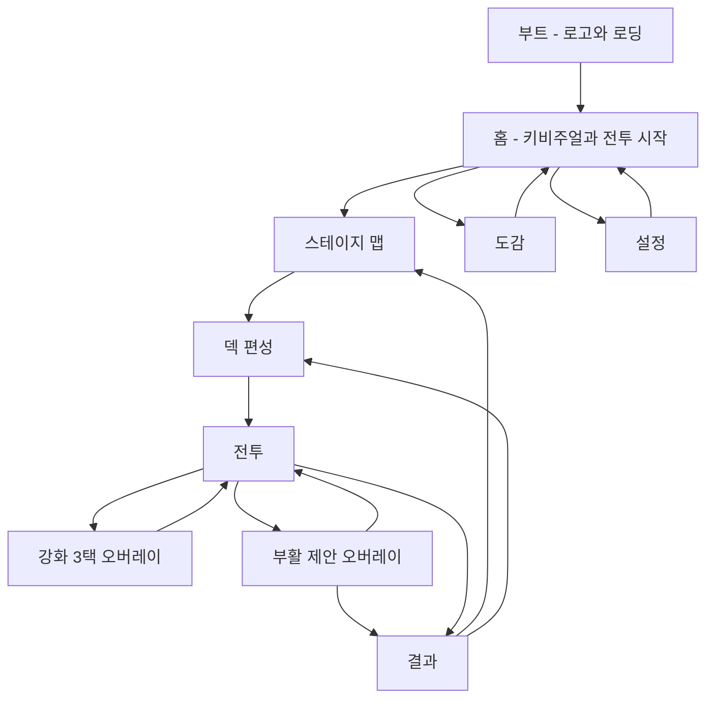

# UI UX 명세

- 제품명: 면역 전쟁 (Immunity War)
- 문서 상태: approved
- 소유자: ih@toss.im
- 버전/수정일: v0.1 / 2026-08-23
- Source of truth: 화면 계약, 내비게이션, 디자인 토큰, 상태·피드백 규칙, 첫 세션 스토리보드
- Depends on: 02-gdd v0.1
- Open blockers: 키스크린·와이어프레임 이미지는 아트 스타일 앵커 승인 후 첨부 (04 문서 게이트 2~3)
- 승인 근거: 사용자 승인 "승인한다" / 2026-08-23 (G1 설계 팩 승인)

## 내비게이션 그래프

- back behavior: Android back = 화면 스택 pop. 전투 중 back은 일시정지 오버레이(계속/포기). 오버레이 표시 중 back은 오버레이 닫기(강화 3택 제외 — 선택 필수).
- modal 위 modal 금지. 강화 3택 중에는 일시정지 진입 불가(이미 정지 상태).
- app resume: 전투 중이면 일시정지 상태로 복귀. 그 외 화면은 그대로.
- deep link/알림 진입: 출시 범위 없음.

## 디자인 시스템

| Token group | Token | Value | Usage | Contrast/scale rule |
| --- | --- | --- | --- | --- |
| color | color.bg.deep | #061615 | 앱 배경 | 텍스트 대비 4.5:1 이상 유지 |
| color | color.surface | #0A2422 90% | 패널·카드 | 위 텍스트 #F7FFF9 |
| color | color.action.primary | #20C7A6 | 주 CTA | 전경 #062320, 대비 5:1 이상 |
| color | color.text.primary | #F7FFF9 | 본문·수치 | 배경 대비 12:1 |
| color | color.text.sub | #D8FFF2 | 보조 설명 | 대비 9:1 |
| color | color.reward | #FFD966 | 보상·사이토카인 | 아이콘+숫자 병기 (색 단독 금지) |
| color | color.danger | #FF6A55 | 기지 피해·실패 | 아이콘+모션 병기 |
| color | color.cell.macrophage 등 8종 | 세포별 고정 hex (04 문서 팔레트 소유) | 카드·유닛·스킬 | 세포 구분은 색+실루엣+아이콘 3채널 |
| type | type.display | NotoSansKR 40/Bold | 타이틀 | 최대 2줄 말줄임 없음 |
| type | type.title | NotoSansKR 24/Bold | 화면 제목 | 한국어 최대 8자 기준 |
| type | type.body | NotoSansKR 16/Regular | 본문 | 장문 autowrap, 최소 14 |
| type | type.number | NotoSansKR 18/Bold tabular | HUD 수치 | 자릿수 증가 시 폭 고정 |
| space | space.unit | 4px 그리드 (4/8/12/16/24) | 전 레이아웃 | 터치 타깃 최소 48dp |
| shape | shape.radius | 12px (카드) / 8px (버튼) | 패널·버튼 | 일관 유지 |
| motion | motion.press | 90ms scale 0.96 | 모든 버튼 | reduced motion 시 알파만 |
| motion | motion.reward | 450ms count-up + 파티클 | 보상 지급 | reduced 시 즉시 표기 |
| motion | motion.transition | 220ms fade+slide | 화면 전환 | reduced 시 fade만 |

## 화면 계약

| Screen ID | 이름 | 목적/판타지 | 진입 | 주 행동 | 종료 | owner |
| --- | --- | --- | --- | --- | --- | --- |
| SCR-001 | 홈 | 미시 세계 키비주얼 + 즉시 전투 진입 | 부트 완료 | 전투 시작 | 스테이지 맵 | UI |
| SCR-002 | 스테이지 맵 | 감염 부위를 따라가는 진행 체감 | 홈·결과 | 스테이지 선택 | 덱 편성 | UI |
| SCR-003 | 덱 편성 | 상성 고민과 부대 구성 | 스테이지 선택 | 리더·동료 선택 후 출격 | 전투 | UI |
| SCR-004 | 전투 | 핵심 플레이 — 세포 부대의 방어전 관전+개입 | 출격 | 리더 스킬·증원 | 결과 | UI |
| SCR-005 | 강화 3택 오버레이 | 런 빌드 결정 | 웨이브 클리어 | 강화 1개 선택 | 전투 복귀 | UI |
| SCR-006 | 결과 | 보상 확인과 학습 카드 | 전투 종료 | 확인 (선택: 보상 2배 광고) | 스테이지 맵 | UI |
| SCR-007 | 도감 | 세포·적·학습 카드 수집 열람 | 홈 | 카드 열람 | 홈 | UI |
| SCR-008 | 설정 | 오디오·햅틱·접근성·정책 | 홈 | 토글 조작 | 홈 | UI |

### SCR-001 — 홈

- 목적/판타지: 5초 안에 "미시 세계 방어전" 장르가 읽히고 다음 행동이 전투 시작 하나로 명확
- target persona와 사용 맥락: PER-001~003 공통, 세션 시작점
- 진입 조건/entry source: 부트 완료, 설정·도감에서 back
- 성공적으로 끝난 상태: 전투 시작 탭 → 스테이지 맵
- primary action: 전투 시작 (마지막 미클리어 스테이지 표기 포함, 예: 2-4 출격)
- secondary actions: 도감, 설정, 사이토카인 잔액 표시(정보)
- back/close behavior: Android back = 앱 종료 확인 다이얼로그
- loading/network/save dependency: 저장 로드 완료 후 진입 (부트에서 처리)
- analytics screen/event: screen_view home

시각 hierarchy:

| Priority | Element/Zone | 플레이어가 읽어야 할 것 | size/position | contrast/motion | 최대 정보량 |
| ---: | --- | --- | --- | --- | ---: |
| 1 | 키비주얼 (상단 55%) | 세포 vs 박테리아 대치 라이브 씬 | 화면 상단 55% | 유닛 idle 모션 상시 | 유닛 6~8기 |
| 2 | 전투 시작 CTA | 다음 스테이지 출격 | 하단 중앙, 폭 90%, 높이 56dp | primary 색 + 펄스 | 라벨 1줄 |
| 3 | 진행 요약 | 현재 챕터·사이토카인 | CTA 위 1줄 | 보조 대비 | 항목 2개 |
| 4 | 도감·설정 | 존재 인지 | 우상단 아이콘 2개 44dp | 저대비 | 아이콘만 |

### SCR-002 — 스테이지 맵

- 목적/판타지: 몸속 감염 부위를 따라 전선이 이동하는 진행 체감
- 진입 조건: 홈 전투 시작, 결과 화면 확인
- 성공 상태: 스테이지 탭 → 덱 편성
- primary action: 다음 미클리어 스테이지 노드 탭 (자동 포커스)
- secondary actions: 클리어 스테이지 재도전, 챕터 전환 스와이프
- back: 홈으로
- 상태: 노드 = locked(자물쇠+저채도) / current(펄스 강조) / cleared(체크+별점 없음, 클리어 마크만)
- analytics: screen_view stage_map

시각 hierarchy: 챕터 배경 일러스트(부위 단면) 위에 경로형 노드 배치. 노드 터치 타깃 56dp. 현재 노드가 화면 중앙으로 자동 스크롤.

### SCR-003 — 덱 편성

- 목적/판타지: 부대 구성 — 상성 고민이 일어나는 곳
- 진입 조건: 스테이지 선택 (스테이지 정보와 등장 적 태그가 함께 표시됨)
- 성공 상태: 출격 탭 → 전투
- primary action: 출격
- secondary actions: 리더 슬롯·동료 슬롯 3개에 세포 배정(탭→목록에서 선택), 세포 상세 열람(길게 누르기), 레벨업(사이토카인 소비)
- back: 스테이지 맵
- loading/save dependency: 덱 변경 즉시 meta.last_deck 저장
- analytics: screen_view deck, cell_leveled

시각 hierarchy:

| Priority | Element/Zone | 읽어야 할 것 | size/position | contrast/motion | 최대 정보량 |
| ---: | --- | --- | --- | --- | ---: |
| 1 | 덱 슬롯 4개 (상단 1/3) | 리더(대형 슬롯)+동료 3 | 리더 96dp, 동료 72dp | 선택 시 확대·시너지 뱃지 갱신 | 4 슬롯 |
| 2 | 등장 적 미리보기 | 이번 스테이지 적 태그 (상성 힌트) | 슬롯 아래 1줄 | 태그 칩 | 칩 4개 |
| 3 | 시너지 표시 | 활성 시너지 (innate 3 등) | 적 미리보기 아래 | 활성 시 점등 모션 | 2개 |
| 4 | 보유 세포 목록 | 배정 가능 세포·레벨 | 하단 스크롤 그리드 | locked 저채도 | 8 카드 |
| 5 | 출격 CTA | 준비 완료 | 최하단 고정 56dp | primary | 1줄 |

### SCR-004 — 전투 (메인 플레이 화면)

- 목적/판타지: PIL-002 — 세포 부대가 실제로 싸우는 미시 전장. Anti-dashboard Gate의 핵심 검증 대상
- 진입 조건: 출격
- 성공 상태: 전 웨이브 방어 → 결과 / 기지 HP 0 → 부활 제안 or 결과
- primary action: 리더 스킬 버튼 (쿨다운 라디얼 표시)
- secondary actions: 증원 버튼(게이지 충전 시 활성), 일시정지
- back: 일시정지 오버레이 (계속 / 포기 — 포기는 실패 처리 확인 문구)
- analytics: level_start, wave_reached, 스킬·증원 사용 파라미터

시각 hierarchy:

| Priority | Element/Zone | 읽어야 할 것 | size/position | contrast/motion | 최대 정보량 |
| ---: | --- | --- | --- | --- | ---: |
| 1 | 전장 (중앙 70%) | 세포·박테리아 전투 인과 — 누가 어디서 밀리는지 | 세로 중앙 70%, 3레인 | 유닛 모션·투사체·처치 이펙트 | 동시 유닛 20~26 |
| 2 | 기지 경계선 (좌측) | 지켜야 할 것과 피해 순간 | 좌측 세로 라인+글로우 | 피해 시 플래시+흔들림 | 게이지 1 |
| 3 | 스킬·증원 버튼 (하단) | 지금 쓸 수 있는 개입 수단 | 하단 중앙, 각 64dp, 엄지 존 | 사용 가능 시 발광, 쿨다운 라디얼 | 버튼 2 |
| 4 | 상단 HUD | 기지 HP·웨이브 x/y | 상단 1줄 슬림 바 | 수치+바 병행 | 항목 3 |
| 5 | 웨이브 배너 | 웨이브 시작·이름 | 중앙 상단 1.2s 토스트 | 슬라이드 인·아웃 | 1줄 |

- 금지: 상단 HUD가 패널형으로 두꺼워져 전장을 침식하는 구성(현 프로토타입의 3x2 그리드 패널 폐기). 전장 면적 70% 미만 금지.
- 행동 인과: 스킬 탭 → 같은 프레임에 버튼 press + 리더 세포 발광 → 0.2s 내 스킬 이펙트 발동 → 피해 숫자 대신 적 피격 플래시·넉백으로 결과 표현.

### SCR-005 — 강화 3택 오버레이

- 목적/판타지: 런 빌드의 의미 있는 선택. 전투 위 오버레이 (전장이 흐리게 비침 — 맥락 유지)
- 진입 조건: 웨이브 클리어 (마지막 웨이브 제외)
- 성공 상태: 카드 1개 선택 → 다음 웨이브
- primary action: 강화 카드 탭 (카드 3장 세로 중앙 배치, 각 88dp 높이)
- secondary actions: 없음 (선택 필수, 시간 제한 없음)
- back: 무시 (선택 필수 안내 흔들림 모션)
- analytics: upgrade_picked

카드 구성: 아이콘 + 이름 + 효과 1줄 + rarity 색 테두리(common 청록/rare 금색 — 테두리+뱃지 이중 표기).

### SCR-006 — 결과

- 목적/판타지: 성과 확인 + 면역 학습 카드 1장 (PIL-003)
- 진입 조건: 전투 종료
- 성공 상태: 확인 → 스테이지 맵 (실패 시: 다시 도전 CTA 우선)
- primary action: 승리 = 확인 / 패배 = 다시 도전
- secondary actions: 보상 2배 광고(승리·명확한 광고 아이콘+보상 표기), 덱 바꾸기(패배 시)
- back: primary와 동일
- analytics: level_end, ad_reward_claimed, card_seen

구성: 결과 배너(방어 성공/실패) → 보상 카운트업 → 첫 클리어 시 학습 카드 플립 연출 → CTA. 패배 시 실패 원인 힌트 1줄 (예: 두꺼운 박테리아에는 용해 태그가 유효합니다).

### SCR-007 — 도감

- 목적: 세포·적·학습 카드 수집 열람. 해금 진행이 수집욕 자극
- primary action: 탭 전환(세포/적/학습 카드) + 카드 탭 상세
- 상태: 미해금 = 실루엣+해금 조건 표기. 상세 = 스탯·태그·스킬·플레이버 텍스트
- back: 홈. analytics: screen_view codex

### SCR-008 — 설정

- 목적: BGM/SFX/햅틱 토글, 흔들림·플래시 감소(reduced motion), 개인정보처리방침 링크, 오픈소스 라이선스, 저장 데이터 안내(기기 로컬 저장·이전 불가 명시), 버전 표기
- primary action: 토글 즉시 적용·저장
- back: 홈. analytics: screen_view settings

## 상태 매트릭스

| Component | default | pressed | selected | disabled | locked | loading | empty | error/offline | success/purchase |
| --- | --- | --- | --- | --- | --- | --- | --- | --- | --- |
| 주 CTA 버튼 | primary 배경 | scale 0.96+명도 하강 | 해당 없음 | 회색+사유 라벨 | 해당 없음 | 스피너 대체 | 해당 없음 | 재시도 라벨 | 성공 모션 |
| 세포 카드 | 초상+레벨 | scale 0.96 | 테두리 발광+체크 | 해당 없음 | 실루엣+해금 조건 | 해당 없음 | 해당 없음 | 해당 없음 | 레벨업 파티클 |
| 강화 카드 | rarity 테두리 | scale 0.96 | 확대 후 적용 | 해당 없음 | 해당 없음 | 해당 없음 | 해당 없음 | 해당 없음 | 적용 플래시 |
| 스킬 버튼 | 발광 (사용 가능) | 눌림+발동 | 해당 없음 | 쿨다운 라디얼+초 | 해당 없음 | 해당 없음 | 해당 없음 | 해당 없음 | 발동 링 |
| 광고 버튼 | 광고 아이콘+보상 표기 | scale 0.96 | 해당 없음 | 해당 없음 | 해당 없음 | 로드 중 스피너 | 해당 없음 | 미노출 (로드 실패) | 보상 지급 연출 |
| 스테이지 노드 | 번호 | scale 0.96 | 펄스 (current) | 해당 없음 | 자물쇠+저채도 | 해당 없음 | 해당 없음 | 해당 없음 | 클리어 체크 스탬프 |

## 피드백과 게임 필

| Event ID | Trigger | 즉시 반응 | 행동 인과 | 결과/VFX | SFX | haptic | camera | duration | reduced motion |
| --- | --- | --- | --- | --- | --- | --- | --- | --- | --- |
| FB-001 스킬 발동 | 스킬 버튼 탭 | 버튼 press+리더 발광 | 리더에서 이펙트 발생 | 스킬별 고유 VFX (04 문서) | 스킬별 고유 | medium | 없음 | 0.5s | 파티클 수 1/3 |
| FB-002 적 처치 | HP 0 | 피격 플래시 | 마지막 타격 방향으로 파열 | 링 파열+잔상 | 짧은 pop | light | 없음 | 0.34s | 플래시 제거 |
| FB-003 기지 피해 | 적 경계 도달 | 경계선 플래시 | 도달 지점에서 파열 | 화면 가장자리 붉은 비네트 | 둔탁 경고 | strong | 미세 흔들림 | 0.4s | 흔들림 제거 |
| FB-004 웨이브 클리어 | 마지막 적 처치 | 전장 슬로우 0.3s | 클리어 배너 | 배너 슬라이드 | 스팅어 | medium | 없음 | 1.0s | 슬로우 제거 |
| FB-005 강화 적용 | 카드 선택 | 카드 확대 | 대상 세포 발광 | 세포 위 상승 파티클 | confirm | light | 없음 | 0.6s | 발광만 |
| FB-006 보상 지급 | 결과 진입 | 카운트업 | 사이토카인 아이콘 플라이 | 수집 파티클 | 코인 스트림 | light | 없음 | 0.8s | 즉시 합산 |
| FB-007 해금 | 첫 클리어 보상 | 카드 플립 | 실루엣→컬러 전환 | 금색 버스트 | 해금 스팅어 | strong | 없음 | 1.2s | 플립만 |

- 처치/기지 피해/보상/해금은 각각 다른 색·파티클 언어 사용 (04 문서 VFX 언어와 동기).
- 모든 major 연출은 탭으로 skip 가능.

## 접근성

| Barrier | 대상 화면/행동 | 기본 지원 | 옵션 | test |
| --- | --- | --- | --- | --- |
| 색각 | 세포/적 구분, rarity | 색+실루엣+아이콘 3채널 | 없음 (기본 충족) | 그레이스케일 스크린샷 판독 |
| 저시력 | HUD 수치 | 대비 9:1 이상, 최소 14pt | 없음 | 대비 측정 |
| 청각 | 웨이브 시작·기지 피해 | 시각 배너·비네트 병행 (음소거 플레이 완전 가능) | BGM/SFX 독립 볼륨 | 음소거 완주 테스트 |
| 광과민/멀미 | 플래시·흔들림 | 기본 강도 제한 | reduced motion 토글 (플래시·흔들림·파티클 감소) | 토글 온 상태 완주 |
| 조작 | 전 버튼 | 최소 48dp, 한손 엄지 존 배치 | 없음 | 터치 타깃 오버레이 검사 |
| 시간 압박 | 강화 3택·전투 | 3택 무제한, 일시정지 지원 | 없음 | 방치 후 복귀 테스트 |

- 스크린 리더 완전 지원은 출시 범위에서 제외 (Godot Control 접근성 한계). 제외를 07 문서 스토어 심사 관점에서 재확인.

## 반응형 기기 매트릭스

| Device class | viewport/aspect | safe area | layout 변화 | text scale | 검증 evidence |
| --- | --- | --- | --- | --- | --- |
| compact | 360x740 (18.5:9) | 상태바만 | 전장 유닛 스케일 0.92, HUD 동일 | 고정 | 스크린샷 + 터치 겹침 검사 |
| reference | 390x844 (19.5:9) | notch 상단 47pt | 기준 레이아웃 | 고정 | 전 화면 스크린샷 세트 |
| tall | 412x915 (20:9) 및 iPhone Pro Max | Dynamic Island | 전장 세로 확장 (레인 간격 증가), HUD 위치 고정 | 고정 | 스크린샷 |
| tablet/wide | iPad 및 데스크톱 창 | 홈 인디케이터 | 고정 playable aspect 19.5:9 + 좌우 장식 letterbox (스트레치 금지) | 고정 | iPad 스크린샷 |

- 전투 레이아웃 상수(레인 y, 기지 x)는 viewport 기반 비율로 재정의한다 (현 프로토타입의 절대좌표 폐기 — 06 문서).

## 첫 세션 스토리보드

| 시간 | Frame ID | 화면 focal point | 플레이어 행동 | feedback | copy | 다음 목표 |
| ---: | --- | --- | --- | --- | --- | --- |
| 0~5s | FR-001 부트 | 로고+세포 실루엣 | 대기 | 로딩 바 | 면역 전쟁 | 없음 |
| 5~10s | FR-002 홈 | 키비주얼 대치 씬 | 전투 시작 탭 | 버튼 펄스 | 침투가 시작됩니다 | 막아내기 |
| 10~15s | FR-003 인트로 | 박테리아가 경계로 번짐 | 관전 | 인트로 모션 | 조직 경계를 지켜내세요 | 전투 |
| 15~45s | FR-004 웨이브1 | 세포들이 자동 교전 | 스킬 버튼 탭 (강조 유도) | FB-001+처치 | 리더 스킬을 사용해 보세요 | 웨이브 클리어 |
| 45~60s | FR-005 강화 3택 | 카드 3장 | 1장 선택 | FB-005 | 다음 웨이브 전에 부대를 강화하세요 | 웨이브2 |
| 60~150s | FR-006 웨이브2~3 | 증원 게이지 충전 | 증원 탭 | 새 세포 등장 | 증원이 준비되었습니다 | 방어 완수 |
| 150~180s | FR-007 결과 | 보상 카운트업+학습 카드 | 확인 | FB-006, FB-007 | 대식세포는 침입자를 먼저 붙잡는 최전선입니다 | 다음 스테이지 |
| 180~300s | FR-008 맵→1-2 | 다음 노드 펄스 | 1-2 진입 | 노드 이동 연출 | 감염이 번지고 있습니다 | 새 적 대응 |

## UI 인수 증거

| Evidence ID | Screen/State | target device | annotated screenshot/video | 통과 기준 | 결과 |
| --- | --- | --- | --- | --- | --- |
| EV-001 | SCR-004 전투 웨이브 중 | reference + compact | 전장 비율·시선 순서 주석 | 전장 70%+, 5초 장르 판독, 대시보드 아님 | Vertical Slice에서 기록 |
| EV-002 | SCR-004 스킬·증원 상태 | reference | 쿨다운·활성 상태 영상 | 같은 프레임 press 반응 | Vertical Slice에서 기록 |
| EV-003 | 첫 세션 5분 | 실기기 Android+iOS | 무편집 영상 | 스토리보드와 일치, 막힘 없음 | Vertical Slice에서 기록 |
| EV-004 | SCR-005 강화 3택 | compact | 스크린샷 | 카드 3장 겹침·잘림 없음 | Vertical Slice에서 기록 |
| EV-005 | 전 화면 states | reference | 상태 매트릭스별 캡처 시트 | 매트릭스 전 항목 구현 | Content Complete에서 기록 |
| EV-006 | tablet letterbox | iPad | 스크린샷 | 스트레치 없음, 장식 letterbox | Hardening에서 기록 |
