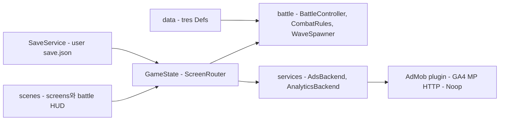

# 기술 제작 계획

- 제품명: 면역 전쟁 (Immunity War)
- 문서 상태: draft
- 소유자: ih@toss.im
- 버전/수정일: v0.1 / 2026-08-23
- Source of truth: 아키텍처, 데이터·저장 스키마, 분석 이벤트, 성능 예산, 제작 단계
- Depends on: 02-gdd v0.1, 05-economy v0.1
- Open blockers: BLK-003 (AdMob 앱·광고 단위 ID), BLK-TEC-001 (GA4 프로비저닝 — seorilabs-game-provisioning으로 Phase 4에 실행)
- 승인 근거: 사용자 승인 전

## 아키텍처와 엔진

- 선택 엔진/버전과 공식 확인일: Godot 4.7.2 stable (2026-08-18 릴리스, 2026-08-23 확인). 로컬·CI 모두 4.7.2로 검증 완료 (CI run 성공 2026-08-23)
- 대안과 기각 이유: 엔진 교체 없음 — 기존 Godot 프로젝트이며 요구사항(2D 세로 모바일, Android/iOS export)을 모두 충족
- target platform/export: Android AAB (Gradle build, minSdk 24), iOS (Xcode Cloud archive). Web export는 AIT 후속 단계 대비 호환만 유지
- domain / application / presentation / platform adapter 경계: 전투 로직(BattleController·CombatRules)은 UI 무참조 → 헤드리스 시뮬 가능. 플랫폼 SDK(광고·분석)는 services 어댑터 뒤 격리
- deterministic simulation/tick: 전투는 `_process` delta 기반이되 스폰·강화 추출은 `RandomNumberGenerator(run.rng_seed)`로 재현 가능. balance_sim은 고정 delta로 실행
- third-party SDK inventory: AdMob 플러그인 1개만 (godot-sdk-integrations/godot-admob v7.0, 2026-05-27 릴리스, Godot 4.7 지원 명시 — 확인 2026-08-23. 폴백: poingstudios v5.0.0). Firebase SDK 미도입



### 디렉토리·씬 구조 (godot/)

```text
scenes/main.tscn                    ScreenRouter 루트
scenes/screens/{home,stage_select,deck,result,codex,settings}_screen.tscn
scenes/battle/{battle_scene,cell_unit,enemy_unit,boss_biofilm_core,projectile,hit_fx,upgrade_overlay}.tscn
scripts/autoload/{db,game_state,save_service,audio_service,analytics,ads}.gd
scripts/battle/{battle_controller,wave_spawner,unit_registry,combat_rules,skill_system,battle_hud,cell_unit,enemy_unit,projectile,node_pool}.gd
scripts/data/{cell_def,enemy_def,skill_def,wave_def,stage_def,chapter_def,upgrade_def,synergy_def}.gd
scripts/ui/{screen_router,screen_base,cell_card}.gd
scripts/services/{ads_backend,admob_backend,noop_ads,analytics_backend,ga4_mp_backend,noop_analytics}.gd
data/{cells,enemies,skills,stages,upgrades,synergies}/*.tres
theme/app_theme.tres
tests/{test_runner,balance_sim,economy_sim,visual_capture}
```

- 오토로드 6개: Db(.tres 인덱스·무결성), GameState(메타+런 상태, 시그널 허브), SaveService, AudioService, Analytics, Ads
- GDScript strict typing. Godot 4.7 규칙: typed return 오버라이드는 모든 경로 명시 return
- 기존 코드 재사용: 웨이브 스포너 전개·정렬(battle_director L252-269), 타깃·위협도 질의, 표식 1.45x, 세포 이동 AI(사거리 x0.62 앵커), 스킬 3종 파라미터. 폐기: main.gd 화면 관리, game_data.gd const Dictionary, biomotion_canvas.gd, 절대좌표 레이아웃

## 데이터 계약

| Schema | owner file | version | fields/ID | validation | migration | test |
| --- | --- | ---: | --- | --- | --- | --- |
| CellDef | scripts/data/cell_def.gd | tres | id, name, tags, hp, damage, attack_range, attack_rate, speed, skill, sprite_frames, unlock | Db 로드 시 id 중복·참조 검사 | 리소스 필드 기본값 | 스모크 Db 무결성 |
| EnemyDef | enemy_def.gd | tres | id, name, tags, hp, speed, base_damage, radius, special | 동일 | 동일 | 동일 |
| SkillDef | skill_def.gd | tres | id, kind(enum), cooldown, params(typed) | kind별 필수 param 검사 | 동일 | 스킬 시뮬 |
| StageDef/ChapterDef | stage_def.gd | tres | id, waves, modifiers, rewards, unlock, boss | 웨이브 적 id 참조 검사 | 동일 | balance_sim |
| UpgradeDef/SynergyDef | upgrade_def.gd | tres | id, rarity, effect_kind, target, value | effect_kind 범위 | 동일 | 시뮬 |
| Save | user://save.json | 1 | 02 문서 저장 계약 표 | 파싱+타입 검사 | MIGRATIONS 순차 Callable | 픽스처 라운드트립 |

### 세이브 스키마 v1

```json
{
  "version": 1,
  "updated_at_unix": 0,
  "settings": {"bgm": true, "sfx": true, "haptic": true, "reduced_motion": false},
  "meta": {
    "currency": 0,
    "cells": {"macrophage": {"unlocked": true, "level": 1}},
    "stages": {"1-1": {"cleared": true, "best_wave": 3}},
    "last_deck": {"leader": "macrophage", "members": ["neutrophil", "b_cell", ""]},
    "codex_seen": []
  },
  "run": null,
  "flags": {"tutorial_done": false},
  "client_id": "uuid-v4"
}
```

- 쓰기: `save.json.tmp` 작성 → `DirAccess.rename` 원자 교체 → 성공 시 이전본을 `.bak` 유지
- 마이그레이션: `SaveService.MIGRATIONS: Array[Callable]`, version < CURRENT면 순차 적용. 실패·손상 시 `.bak` 폴백, run 필드는 무효 시 단독 폐기(메타 보존)

## 분석 이벤트 분류

GA4 Measurement Protocol 직송 (Firebase SDK 미도입 — 분석 외 Firebase 제품 필요 없음, godot-game 스킬 규칙 부합). client_id는 로컬 UUID. 전송 실패 시 로컬 큐(최대 200건) 후 재전송. GA4 권장 게임 이벤트를 우선 재사용한다.

| Question/KPI | Metric definition/window/denominator | Event | Trigger | Required params | user property | validation | privacy |
| --- | --- | --- | --- | --- | --- | --- | --- |
| 스테이지 퍼널 어디서 이탈하나 | 스테이지별 시작 대비 클리어율 (일 단위, 시작 수 분모) | level_start / level_end | 전투 시작/종료 | level_name(1-1형), success, duration_sec, wave_reached, deck_leader, revive_used | chapter_progress | GA4 DebugView + BigQuery row | 개인정보 없음 |
| 강화 메타가 작동하나 | 강화별 픽률·픽 후 승률 | upgrade_picked | 3택 선택 | upgrade_id, wave, level_name | 없음 | 동일 | 없음 |
| 웨이브 난이도 스파이크 | 웨이브 도달 분포 | wave_reached | 웨이브 시작 | level_name, wave | 없음 | 동일 | 없음 |
| 광고가 수익·리텐션에 기여하나 | placement별 노출 대비 완료율 | ad_reward_claimed | 보상 지급 | placement(revive/double), result(earned/canceled/failed) | 없음 | 동일 | 광고 ID 미수집 |
| 경제 인플레이션 여부 | earn/spend 비율, 잔액 분포 | earn_virtual_currency / spend_virtual_currency | 지급/소비 | virtual_currency_name(cytokine), value, source/item_name, balance | 없음 | 동일 | 없음 |
| 수집 진행 | 해금 시점 분포 | unlock_achievement | 세포 해금 | achievement_id(cell_id) | cells_unlocked | 동일 | 없음 |
| FTUE 완료율 | tutorial_begin 대비 complete | tutorial_begin / tutorial_complete | FTUE-001/005 | 없음 | 없음 | 동일 | 없음 |
| 저장 안정성 | 오류 발생률 | save_error | 로드·저장 실패 | code(parse/io/migration), recovered | 없음 | 동일 | 없음 |

## 성능 예산

| Scene/Device tier | FPS/frame time | memory | load/cold start | draw/asset budget | thermal/battery | measurement tool |
| --- | --- | --- | --- | --- | --- | --- |
| 전투 / mid Android (Galaxy A2x급) | 60fps 목표, 최저 30 유지 | 400MB 이하 | cold start 4s 이하 | 동시 유닛 26, 파티클 노드 24, draw call 120 이하 | 20분 플레이 발열로 스로틀 시 30fps 유지 | Godot profiler + Android GPU Inspector |
| 전투 / iPhone SE급 | 60fps | 350MB 이하 | 3s 이하 | 동일 | 동일 | Xcode Instruments |
| 앱 크기 | 해당 없음 | 해당 없음 | 해당 없음 | AAB 60MB 이하, iOS 80MB 이하 (스프라이트 아틀라스 예산 04 문서) | 해당 없음 | 빌드 산출물 측정 |

## 저장 마이그레이션

| From → To | transform | validation | fallback | irreversible | test fixture |
| --- | --- | --- | --- | --- | --- |
| v0(프로토타입 무저장) → v1 | 신규 생성 (마이그레이션 불필요) | 스키마 파싱 | 기본값 생성 | 아니오 | tests/fixtures/save_v1.json |
| v1 → v2 (향후) | MIGRATIONS[1] Callable로 필드 추가·변환 | 라운드트립 검증 | v1 `.bak` 유지 | 문서화 후 결정 | 버전별 픽스처 추가 |

## 백엔드와 보안 경계

- authoritative state: 전부 클라이언트 로컬 (오프라인 게임, 서버 없음)
- auth/account deletion: 계정 없음. 저장 삭제 = 앱 삭제 (설정 화면에 명시)
- secret handling: GA4 api_secret은 빌드 시점 주입(CI secret) — 리포지토리에 커밋 금지. AdMob 앱 ID는 공개 식별자로 취급하되 동일하게 config로 분리
- App Check/attestation: 미적용 (서버 자산 없음)
- rate limit/idempotency: 분석 큐 재전송은 이벤트 timestamp 보존으로 중복 허용 범위 관리
- offline queue/conflict: 분석 로컬 큐 200건 상한, 초과 시 오래된 것부터 폐기
- abuse/cheat model: 로컬 세이브 조작 가능성 인지 — 순위·경쟁 요소가 없어 타 유저 피해 없음. 무결성 검증은 도입하지 않음 (명시적 결정)

## 플랫폼 연동

| Integration | iOS | Android | Web/AIT | adapter | sandbox/test | launch blocker |
| --- | --- | --- | --- | --- | --- | --- |
| AdMob rewarded | godot-admob v7.0 iOS export plugin (Info.plist GADApplicationIdentifier·SKAdNetwork 주입 — Xcode Cloud 빌드에서 포함 검증) | 동일 플러그인, Gradle build 필수, minSdk 24 | 미지원 → NoopAds 자동 강등 | AdsBackend | 테스트 광고 단위로 스파이크 (Phase 4 첫 작업) | BLK-003 |
| GA4 MP | HTTPRequest 공통 | 동일 | 동일 (후속) | AnalyticsBackend | debug_mode 파라미터로 DebugView 검증 | BLK-TEC-001 |
| 햅틱 | Input.vibrate_handheld | 동일 | Noop | AudioService 경유 | 실기기 | 없음 |

## 제작 단계

| Phase | player-visible outcome | systems/data | screens | art/audio/content | commands | runtime evidence | exit criteria |
| --- | --- | --- | --- | --- | --- | --- | --- |
| 1 리팩터 (~2주) | 기존 3웨이브 게임 동일 동작 | Def 8종+.tres 이관, Db, 씬 분리, ScreenRouter, GameState, SaveService v1, 전투 분해 | 기존 화면의 씬화 | 없음 (기존 비주얼 유지) | quality gate + balance_sim 1판 완주 | 스모크 로그, 캡처 스크린샷 | 게이트 그린 + 동작 동등성 |
| 2 시스템 (~2-3주) | 덱·강화·상성·스테이지 진행 플레이 가능 | StatusEffects, 상성표, 덱, Upgrade 3택, 증원, Stage/Chapter, 메타, run 스냅숏 | deck, stage_map, upgrade_overlay | 임시 비주얼 유지 | balance_sim 코호트 | 신규 화면 캡처 | AC-001~003 통과 |
| 3 콘텐츠·아트 (~3-4주) | 챕터1~3 + 최종 아트·사운드 | 세포 8종, 적 6종, 보스, 28 스테이지 데이터 | codex, 보스 연출 | 스타일 앵커→배치 생성→교체, BGM/SFX | balance_sim 전 스테이지 스윕, economy_sim | Vertical Slice 영상 (챕터1 최종 품질) | UI Gate EV-001~004 + AC-005~006 |
| 4 폴리시·출시 (~2주) | 광고·분석 동작, 스토어 제출 가능 빌드 | AdMob 스파이크→통합, GA4 MP, 설정 화면 | settings 완성 | 스토어 자산 | Android/iOS export, 실기기 QA | GA4 DebugView, 광고 시연 영상, 서명 빌드 설치 | 07 문서 Release Gate |

## 빌드와 테스트 명령

| Purpose | Command | Environment | Expected evidence | owner |
| --- | --- | --- | --- | --- |
| 품질 게이트 | `bash scripts/godot_quality_gate.sh --project godot --smoke-scene res://tests/test_runner.tscn` | 로컬·CI (Godot 4.7.2) | import/compile/smoke 로그 무에러 | 에이전트 |
| 밸런스 시뮬 | `godot --headless --path godot res://tests/balance_sim.tscn` | 로컬·CI | 스테이지별 승률·잔여HP 리포트 | 에이전트 |
| 경제 시뮬 | `godot --headless --path godot res://tests/economy_sim.tscn` | 로컬 | evidence/economy-sim-report.md | 에이전트 |
| UI 캡처 | `CAPTURE_PATH=출력경로 godot --path godot res://tests/visual_capture.tscn` | 로컬 macOS | 화면 스크린샷 | 에이전트 |
| Android export | `godot --headless --path godot --export-release Android build/android/app.aab` | x64 Linux CI (RPI ARC 금지) | .aab 산출+서명 | CI |
| iOS archive | Xcode Cloud 파이프라인 | Xcode Cloud | TestFlight 빌드 | CI |
